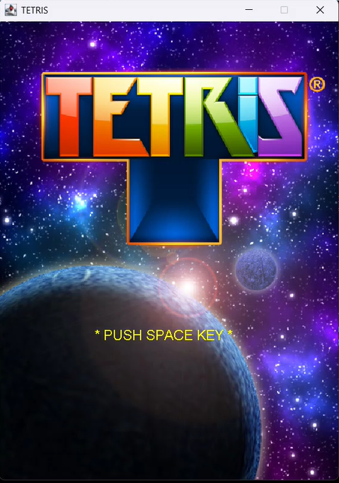
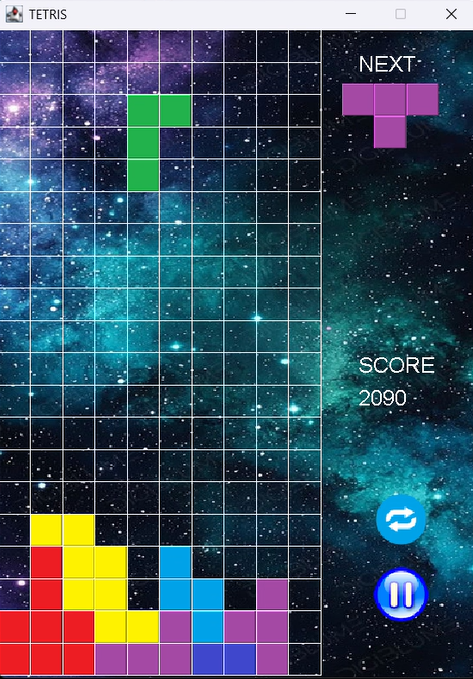

# テトリス Java版
Java Swingを使用して「テトリス」を作成してみました。





## 概要
- **主な機能**:
  - タイトル画面からスペースキーでゲームスタート
  - ポーズ/リセット (画面上のボタンをマウスでクリック)
  - コンボに応じたスコア加算
  - ゲームオーバー後、スペースキーでタイトル画面に戻ります

- **主なクラス構成**:
  - App : ゲーム全体の管理と画面遷移
  - Title : タイトル画面(画像表示・BGM再生)
  - TetrisBoard : ゲームフィールドの描画、ブロック生成、当たり判定、スコア管理、サウンド再生
  - TetrisShape : 各ブロックの回転・移動・落下ロジック
  - Loader : 画像・サウンドのロードユーティリティ

## 操作方法
| アクション | 操作キー |
| ------------ | --------- |
| **回転** | ↑(上キー) |
| **左に移動** | ←(左キー) |
| **右に移動** | →(右キー) |
| **下に移動(ソフトドロップ)** | ↓(下キー) |

## スコア表
| ライン数 | スコア |
| ------------ | --------- |
| **1行** | 100 pts |
| **2行** | 300pts |
| **3行** | 500 pts |
| **4行以降** | 800 pts |

## 動作環境
- JDK 24(Java 11以上)
- Java Swing
- Java Sound API

## 実行方法
1. **Javaをインストール**

   Java Development Kit(JDK)をインストールしてください。

   (最新版のJDKを推奨)

2. **リポジトリのクローン(ダウンロード)**

   ターミナルまたはコマンドプロンプトで以下を実行:
   ```sh
   git clone https://github.com/motomasMINO/Tetris-Java.git

   cd Tetris-Java
3. **アプリ起動**
   ```sh
   java -cp src App
   ```
## ライセンス
このプロジェクトはMIT Licenseのもとで公開されています。

## お問い合わせ
- **GitHub: motomasMINO**
- **Email: yu120615@gmail.com**
 
  バグ報告や改善点・機能追加の提案はPull RequestまたはIssueで受け付けています!

## 謝辞
- Tetris Grand Master(TGM)からインスピレーションを得ました。
- **使用BGM** : Happy Happy, Hardening-drops Normal mix, Grand Master Jingle(Sampling masters MEGA 様, Sampling masters AYA 様)
- 画像・音素材の制作者の皆様に感謝します。
